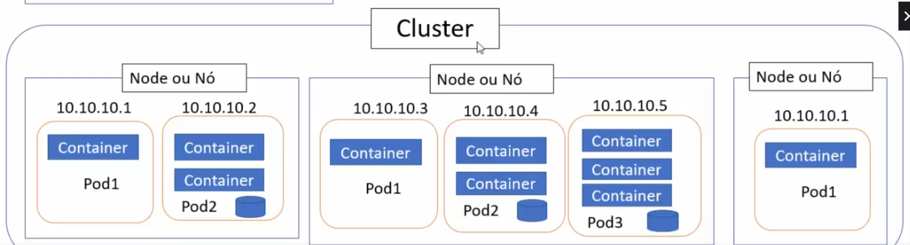
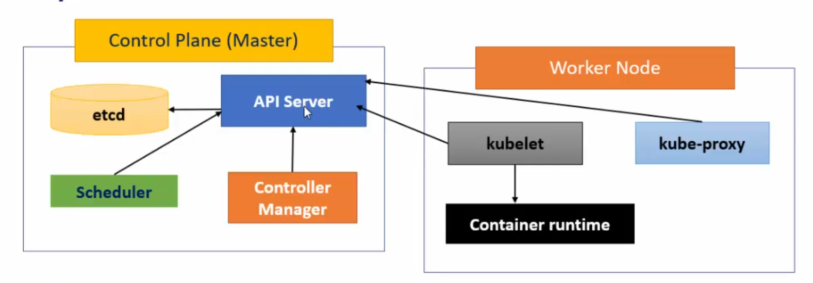
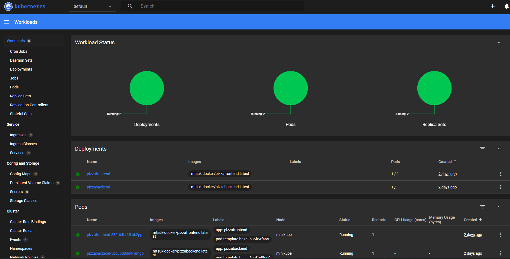

# 1. Kubernetes
<br>

- Realiza a implantação, escalonamento, gerenciamento e orquestração de containers;
- trabalha com qualquer container runtime;

Requisitos: 

- Docker for Windows;
- Minikube; 
- Kubectl;

----

# 2. Sumário
<br>

- [1. Kubernetes](#1-kubernetes)
- [2. Sumário](#2-sumário)
- [3. Pod](#3-pod)
- [4. Node/Nós](#4-nodenós)
- [5. Arquitetura do Kubernetes](#5-arquitetura-do-kubernetes)
- [6. Minikube](#6-minikube)
- [7. Kubectl](#7-kubectl)
- [8. Arquivo manifesto - yaml](#8-arquivo-manifesto---yaml)
- [9. Replicaset](#9-replicaset)
  - [9.1. Criando replicaset1.yml](#91-criando-replicaset1yml)
  - [9.2. Escalando aplicação](#92-escalando-aplicação)
- [10. Deployment](#10-deployment)
  - [10.1. Estratégia](#101-estratégia)
  - [10.2. Criando o Deployment](#102-criando-o-deployment)
  - [10.3. Alterando o Deployment](#103-alterando-o-deployment)
- [11. Services](#11-services)
  - [11.1. Tipos de serviço](#111-tipos-de-serviço)
  - [11.2. Como descobrir e acessar serviços no Kubernetes?](#112-como-descobrir-e-acessar-serviços-no-kubernetes)
  - [11.3. Criar o Services1.yaml](#113-criar-o-services1yaml)
- [12. Gerenciar aplicação no Kubernetes](#12-gerenciar-aplicação-no-kubernetes)
  - [12.1. Alterando a quantidade de replicas](#121-alterando-a-quantidade-de-replicas)
  - [12.2. Deletar Pods, Deployments, Services..](#122-deletar-pods-deployments-services)
  - [12.3. Debugar Pods](#123-debugar-pods)
  - [12.4. KubeConfig](#124-kubeconfig)
  - [12.5. Dashboard](#125-dashboard)
- [13. Ingress](#13-ingress)
  - [13.1. Ingress Controller](#131-ingress-controller)
  - [13.2. Tipos de Ingress](#132-tipos-de-ingress)
- [14. Volumes](#14-volumes)
  - [14.1. Tipos de Volumes](#141-tipos-de-volumes)
  - [14.2. Exemplo de Ephemeral Volume](#142-exemplo-de-ephemeral-volume)
  - [14.3. Exemplos de Persistent Volume](#143-exemplos-de-persistent-volume)
    - [14.3.1. Criar um Persistent Volume (PV)](#1431-criar-um-persistent-volume-pv)
    - [14.3.2. Persistent Volume Claim(PVC)](#1432-persistent-volume-claimpvc)
    - [14.3.3. Criar Pod para testar os volumes](#1433-criar-pod-para-testar-os-volumes)
    - [14.3.4. Rodar o pod1.yaml e os volumes](#1434-rodar-o-pod1yaml-e-os-volumes)

----

# 3. Pod
<br>

É a menor e mais básica estrutura do Kubernetes, semelhante ao container no Docker;

O pod consiste de um ou mais containers, recursos de armazenamento e um único endereço IP;

Um pod representa uma única instância de um processo em execução no seu cluster.

Pods não são projetados para permanecer em execução para sempre, depois de encerrados não podem ser recuperados.

**Ciclo de vida** -> Pending, Running, Succeeded, Failed, Unknow;

- **Pending** - criado e aceito pelo cluster, mas um ou mais contêineres ainda não estão em execução;
- **Running** - pod foi alocado a um Nó, e todos os contêineres foram criados. Pelo menos um contêiner está em execução, no processo de iniciar ou reiniciando;
- **Failed** - Todos os contêineres no pod foram encerrados e pelo menos um com falha;
- **Unknow** - O estado não pode ser determinado;

---

# 4. Node/Nós
<br>

Por padrão, os pods são executados nos Nodes ou Nós, ou seja, no pool de nós padrão do cluster;

Os nós são recrusos de hardware e podem ser uma maquina virtual ou uma máquina física;

Os pods não saõ reestritos a um Nó, logo pode existir mais de um Nó.

O conjunto de Nós se chama **Cluster**;



No cluster existem **2 tipos de nós**:

- **Worker** - Nós que executam os containers nos pods;
- **Master** - Executa os componentes do plano de controle;

Os comando são enviados ao Nó Master (interagimso com o Nó master) e ele define os Nós Workers.

---

# 5. Arquitetura do Kubernetes
<br>

- **kubeadm** - É a ferramenta que automatiza grande parte do processo de criação do cluster.
- **kubelet** - Componente essencial que lida com a execução de pods; Atua como um agente em cada node, intermediando as trocas de mensagens entre API Server e o Docker runtime;
- **kubectl** - É a ferramenta CLI de interação com o cluster kubernetes. Permite executar comandos em clusters, implantar aplicativos, inspecionar e gerenciar recursos de cluster e visualizar logs.
- **etcd** - Provê um sistema distribuído e compartilhado para armazenar informações do estado do cluster. Armazena as informações no formato chave-valor;
- **API Server** - Provê todos os serviços do kubernetes. É um serviço REST. Valida e configura dados para os objetos de API que incluem pods, serviços, controladores de replicação e outros;
- **Controll Manager** - Executa funções em nível de cluster, como replicar componentes, acompanhar nós de trabalho, lidar com falhas, e assim por diante;
- **Scheduler** - Excalona os pods para serem executados nos Nodes.



---

# 6. Minikube
<br>

Existem vários utilitários para executar o kubernetes, o minikube é um deles. Sua vantagem é que é fácil de usar, oferece suporte a diversas plataformas, tem muitas features e muita documentação escrita. Mas não é possível trabalhar com múltiplos Nós e o tempo de inicialização é lento.

Para verificar e iniciar o Minikube (deve ter sido instalado previamente), abrir um terminal e usar os comandos:

    minikube status
    minikube start

Obs. o Docker precisa estar rodando.

# 7. Kubectl
<br>

Este também precisa ser instalado, mas é utilizado para realizar comandos no kubernetes (clusters, nós, pods).

Exemplo de Comandos:

    kubectl cluster infor
    kubectl get all
    kubectl run nginx --imagem nginx
    kubectl apply -f newpod.yaml


----

# 8. Arquivo manifesto - yaml
<br>

Arquivo com definições de deplyments, services, pods, namespaces, replicasets, configmaps, secrets, nodes e outros objetos que desejamos definir.

Ex.:
```yml
apiVersion: v1 #indica a versão da API Kubernetes usada para criar o objeto

Kind: Pod #define o tipo de objeto a ser criado: Pod, Deployments, ReplicaSet, Service, Namescpace

metadata:
    name: pod-ngix #define dados do objeto como name, labels....

spec:               #define especificações do objeto a ser  
    containers:     #criado, varia de acordo com o objeto
        - image:    #containers é uma lista ou array,
        name:       #pois um pod pode conter múltiplos
        ports:      #containers (listas são indicadas com "-")
            - containerPort:
```
---

# 9. Replicaset
<br>

Esse arquivo é semelhante ao docker-compose. Aqui são descritas as orientações para subir os Pods(contêineres) dentro do Node e Cluster.
Aqui é possível configurar para que um Pod seja recriado automáticamente, assim em caso de parada não será necessário recria-lo manualmente.

O replicaset consegue diferenciar os Pods través de labels;

**Labels** são pares chave-valor anexados a Pods, ReplicaSet e serviços. São usados como atributos de identificação;

----

## 9.1. Criando replicaset1.yml

Aqui é interessante ter a extensão Kubernetes para facilitar, criando um esquema inicial no arquivo.
Crie o arquivo replicaset1.yaml e nele digite "replica"  com a extensão instalada ele vai te sugerir um arquivo a ser criado.

```yaml
apiVersion: apps/v1 #define a versão
kind: ReplicaSet #tipo
metadata:
  name: redis-replicaset #nome do replicaset
spec:
  template:
    metadata:
      name: mypod #definições do pod (nome)
      labels:
        app: myApp #label é a identificação do pod
        type: database
    spec:
      containers:
        - name: cont-redis #nome do contêiner
          image: redis #imagem que será utilizada
          ports:
            - containerPort: 80 #porta
  replicas: 3 #quantidade de replicas
  selector:
    matchLabels:
      type: database #qual tipo de label será replicado
```

Comandos para executar o replicaset.yaml:

    kubectl apply -f replicaset1.yaml
    kubectl create - f replicaset1.yaml

Comando para ver os pods em funcionamento:

    kubectl get all

Caso queria deletar um pod para testar se outro será criado:

    kubectl delete pod redis-replicaset-<id_pod>

O número do pod você verifica com o `kubectl get all`;

Caso seja feita alguma alteração no replicaset1.yaml, por exemplo alterar a versão do redis, os Pods só terão sua versão alterada após sua destruição, o que **não ocorre automáticamnete**.

---

## 9.2. Escalando aplicação
<br>

Se quiser aumentar o número de pods use o comando abaixo informando nome e quantidade:

    kubectl scale replicaset redis-replicaset --replicas=6

> O replicaset não permite acrescentar pods, somente pelo que foi atribuido no arquivo e pelo scale. Pods criados manualmente terão status "terminated";


----

# 10. Deployment
<br>

Um deployment é um conceito de nível superior que gerencia ReplicaSets e fornce atualizações declarativas para Pods, juntamente com outros recursos úteis.

Pode-se utilizar o Deploymente para aplicar atualizações continuas de aplicativos em Pods e, da mesma forma, reverter um atualização que falhou.

----

## 10.1. Estratégia
<br>

Uma estratégia de Deployment é uma maneira de alterar ou atualizar um aplicativo. O objetivo é fazer a alteração sem tempo de inatividade de forma que o usuário mal perceba as alterações feitas.

1. **Recreate**: Encerra as instâncias do Pod atualmente em execução e as recria com a nova versão;
2. **RollingUpdate**: Permite uma migração ordenada de uma versão de um aplicativo para uma versão mais recente.(Estratégia padrão do Kubernetes);
3. **Blue/Green**: São criados dois ambientes separados, mas idênticos. Um ambiente (azul) que executa a versão atual do aplicativo e um ambiente (verde) está executando a nova versão do aplicativo;
4. **Canary**: É uma estratégia de implantação que libera um aplicativo ou serviço de forma incremental para um subconjunto de usuários.

----

## 10.2. Criando o Deployment
<br>

Crie o arquivo "deployment1.yaml" com o seguinte conteúdo:

```yml
apiVersion: apps/v1
kind: Deployment #tipo deployment
metadata:
  name: nginx-deploy
spec:
  replicas: 2
  template:
    metadata:
      name: nginx-pod
      labels:
        app: nginx1
    spec:
      containers:
      - name: nginx-container
        image: nginx
        ports:
        - containerPort: 80
  selector:
    matchLabels:
      app: nginx1
```

Execute o comando:

  kubectl apply -f deployment1.yaml

---

## 10.3. Alterando o Deployment
<br>

Altera o valor da imagem nginx para `nginx:1.14.2`

```yml
apiVersion: apps/v1

  #...
        image: nginx:1.14.2
  #...
```

Execute o comando para aplicar as alterações, e na sequência um "get all" para ver as alterações:

    kubectl apply -f deployment1.yaml
    kubectl get all

Se precisar retornar a versão anterior use o comando abaixo:

    kubectl rollout undo deploy nginx-deploy -n default
    kubectl rollout undo deploy <name_metadata> -n <namespace>

---

# 11. Services
<br>

É uma implantação lógica para um grupo implantado de pods em um cluster.

Um service permite que um grupo de pods receba um nome e um endereço de IP exclusivo(clusterIP) e estável;

Enquanto o serviço estiver em execução esse endereço de IP não será alterado mesmo se o Pod morrer ou for excluído;

Conectam um conjunto de pods a um nome de serviço abstrato e um endereço IP e fornecem a descoberta e roteamento entre pods.

Expõe uma Interface a esses pods que permite o acesso à rede de dentro do cluster ou entre processos externos e o serviço.

Principais atributos:


1. **Seletor de labels** que localiza os pods;
2. O endereço IP do **ClusterIP** e o número de porta atribuído;
3. Definições de porta;
4. Mapeamento opcional de portas de entrada para um **targetPort**;
   
-------

## 11.1. Tipos de serviço
<br>

1. **ClusterIP** - Estabelece uma conexão entre diferentes serviços e aplicativos usando um IP Virtual de cluster interno. Esse tipo de serviço só é acessível dentro do cluster;
2. **NodePort** - Permite acessibilidade externa a um Pod em um nó recebendo uma solicitação externa de clientes ou usuários e mapeando na porta de destino e na porta de serviço do Pod. Também expõe um aplicativo externamente com a ajuda de um NodeIp e NodePort que expões uma porta em cada Node.
3. **Loadbalancer** - Compartilha as solicitações do cliente nos servidores de forma contínua, eificiente e uniforme para proteger contra o uso excessivo de recursos do servidor;
4. **ExternalName** - Expõe o serviço usando um nome arbitrário retornando um registro **CNAME** com o nome

------

## 11.2. Como descobrir e acessar serviços no Kubernetes?
<br>

1. **Por meio do DNS do cluster**

Esse método é o recomendado de descoberta de serviços. Para usar esse método, primeiro um servidor DNS deve ser instalado no cluster.

O Servidor DNS monitora a API do kubernetes e quando um novo serviço é criado, seu nome fica disponível para facilitar a resolução dos aplicativos solicitados.

2. **Por meio da variáveis de ambiente nos Nodes/Nós**

Este método depende de usar *kubelet* e adicionar variáveis de ambinte para cada serviço ativo para acda nó em que um Pod está sendo executado.

--------

## 11.3. Criar o Services1.yaml
<br>

Antes vamos criar um novo Deploysment chamado "apachedploy.yaml":

```yaml
apiVersion: apps/v1
kind: Deployment
metadata:
  name: apache-deploy
  labels:
    app: apache-deploy
spec:
  replicas: 3
  selector:
    matchLabels:
      app: apache-webserver
  template:
    metadata:
      labels:
        app: apache-webserver
    spec:
      containers:
      - name: apache
        image: bitnami/apache:latest
        ports:
        - containerPort: 80
```

Rode esse Deployment:

    kubectl apply -f .\apachedeploy.yaml 


Agora crie o arquivo apacheservice.yaml abaixo, para ser aplicado no deploy:

```yaml
apiVersion: v1
kind: Service
metadata:
  name: apache-service
spec:
  type: ClusterIP
  selector:
    app: apache-deploy
  ports:
  - port: 8080
    protocol: TCP
    targetPort: 8080
```

Execute o Service:

    kubectl apply -f .\apacheservice.yaml

----

# 12. Gerenciar aplicação no Kubernetes
<br>

Nesta etapa será utilizado [este projeto](https://github.com/MichelTsukiyama/MVC-Kubernetes/tree/backend).

---

## 12.1. Alterando a quantidade de replicas
<br>

No arquivo frontend-deploy.yaml, basta alterar a quantidade de replicas:

```yaml
apiVersion: apps/v1
kind: Deployment
metadata:
  name: pizzafrontend
spec:
  replicas: 3
  #restante do código....
```
E utilizar o comando `kubectl apply -f frontend-deploy.yml`

    kubectl apply -f <arquivo_de_deploy.yaml>

----

## 12.2. Deletar Pods, Deployments, Services..

Para excluir qualquer objeto, seja pod, deployment... use o comando `kubectl delete`:

    kubectl delete <tipo_objeto> <nome_objeto>

Ex.:

    kubectl delete pod pizzafrontend-6957477898-vs5pk

> É possível usar o comando `kubectl delete -f <nome_arquivo.yaml>`, removendo todos os pods, deployments, services... criados por aquele arquivo;

----

## 12.3. Debugar Pods
<br>

Comando `kubectl get <tipo>` este comando retorna informações básicas de pods, serviços, deployments...

Ex.:

    kubectl get pods
    kubectl get svc
    kubectl get deploy

Caso queira informações mais detalhadas, use o `kubectl describe <tipo> <nome>`:

    kubectl describe pod pizzafrontend-6957898-bxvts
    kubectl describe svc pizzafrontend
    kubectl describe deploy pizzafrontend

Também é possível acessar os logs da aplicação no pod com o `kubectl logs <nome_pod> -c <nome_container>`:

    kubectl logs pizzafrontend-6957898-bxvts

Para executar comandos em um pod use o `kubectl exec -it <nome_pod> -- comando`:

    kubectl exec -it pizzafrontend-6957898-bxvts -- sh

---

## 12.4. KubeConfig
<br>

Arquivo usado para configurar o acesso ao Kubernetes quando usado em conjunto com a ferramenta de linha de comando **kubectl** (ou outros clientes).

No windows está localizado na pasta c:\Users\\{your-user}\\.kube.

Usado para organizar informações sobre clusters, usuários, namespaces e mecanismos de autenticação;

É um arquivo YAML que contém uma combinação de nome de usuário e senho ou um token seguro que, quando lido via código, elimina a necessidade do cliente Kubernetes solicitar autenticação interativa.

É possível usar o comando `kubectl config <comando>` para adicionar, modificar ou remover configuraões neste arquivo. Segue abaixo exemplos de comandos:

    kubectl config current-context - Exibe contexto atual
    kubectl config delete-cluster - Deleta cluster 
    kubectl config delete-context - deleta contexto 
    kubectl config get-clusters - Exibe os clusters definidos
    kubectl config get-contexts - Descreve um ou + contextos
    kubectl config rename-context - Renomeia o context
    kubectl config set - atribui um valor
    kubectl config set-cluster - Define um entrada no cluster 
    kubectl config set-context - Define uma entrada de um context 
    kubectl config set-credentials - define uma entrada de usuário
    kubectl config unset - retira um valor individual
    kubectl config use-context - define o contexto atual
    kubectl config view - Exibe as configurações mescladas ou kubeconfig

-----

## 12.5. Dashboard
<br>

O minikube Dashboard é uma interface do usuário baseada na web para gerenciar seu cluster Kubernetes e aplicativos executados no Kubernetes.

Ele permite:

- Implantar um aplicativo em um contêiner no cluster do Kubernetes;
- Solucionar problemas dos aplicativos executados no kubernetes;
- Criar e modificar objetos como Pods, Deployments, Services e Ingress;
- Dimensionar um deployment, fazer atualizações no aplicativo, reiniciar um pod, etc.

Para acessar use um dos comandos abaixo:

    minikube dashboard
    minikube dashboar url



---

# 13. Ingress
<br>

O Ingress é um objeto Kubernetes cujo trabalho é expor e gerenciar o acesso externo aos Services ou serviços Kubernetes usando rotas HTTP e HTTPS;

Ele expõe rotas HTTP e HTPPS de fora do Cluster para serviços dentro do Cluster e o roteamento de tráfego é controlado por regras definidas no recurso Ingress.

O Ingress fica na frente de vários serviços e atua como um "roteador inteligente" ou ponto de entrada no cluster.

Assim, um Ingress pode controlar vários serviços e isso reduz as complexidades.

É capaz de fornecer balanceamento de carga, terminação SSL e hospedagem virtual baseada em nome.

Seus recursos permitem expor com segurança várias APIs ou aplicativos de um único nome de domínio.

---

## 13.1. Ingress Controller
<br>

Para que o Ingress funcione, seu Cluster deve ter um **Ingress Controller** em execução. Este verifica a solicitação recebida e a repassa ao respectivo Ingress.

Existem muitos Ingress Controllers, como o **ingress-nginx**. Este é desenvolvido pela equipe Kubernetes e o mais popular.

[Outros Ingress Controllers](https://kubernetes.io/docs/concepts/services-networking/ingress-controllers/).

Para habilitar o Ingress utilize o comando abaixo:

    minikube addons enable ingress

Na sequência criar o arquivo `frontend-ingress.yaml`:

```yaml
apiVersion: networking.k8s.io/v1
kind: Ingress
metadata:
  name: frontend-ingress
  annotations:
  #Controla a reescrita da URL
  #Tem como alvo a URI onde o tráfego deve ser redirecionado
  #O valor foi definido como: /
  #Assim para uma correspondência da URI, ela será reescrita para /
    nginx.ingress.kubernetes.io/rewrite-target: /
spec:
  rules:
  #Aqui poderia ter o campo -host: "site.com"
    http:
      paths:
      # Exact - corresponde extamente ao caminho da URL, diferencia maiúscula de minúscula
      # Prefix - A Correspondência é feita para que a URL comece com o valor especificado no campo path, a URL deve ser prefixada com o valor especificado no campo path
      - pathType: Prefix
        path: "/"
        backend:
          service:
            name: pizzafrontend
            port: 
              number: 8080
```

Pa aplicar o Ingress use os comandos abaixo:

    kubectl apply -f frontend-ingress.yaml

**Linux/ macOS** - Abrir o navegador na URL ;

**Windows** 

    minikube tunnel
    minikube ssh
    curl 192.168.49.2

> Estes passos ocorrem no windows devido um problema do minikube com um driver do docker. Posteriormente deve ser corrigido e será possível através da URL.

----

## 13.2. Tipos de Ingress
<br>

1. **Ingress apoiado por um único serviço**

Neste tipo de Ingress apenas um único Serviço é exposto pelo Ingress.

2. **Fanout simples**

Aqui há um host no Ingress e vários serviços são expostos.

3. **Hospedagem virtual baseada em nome**

Neste tipo de Ingress pode haver vários hosts, mas a condição é que o endereço de IP seja mesmo.

4. **TLS**

Protegido por certificado TLS vem sob os tipos de Ingress TLS. Os secrets do Kubernets permitem armazenar e gerenciar informações confidenciais, como senhas, tokens OAuth e chaves ssh.

-----

# 14. Volumes
<br>

Pods e Clusters não persistem informações, para poder armazenar informações de um estado anterior e ser utilizado sempre que atualizar, destruir ou subir um novo Pod utiliza-se os Volumes (como no docker). Os volumes vão persistir as informações e elas continuam intactas mesmo após a destruição do pod.

Um Volume é essencialmente um diretório contendo arquivos, acessível a todos os contêineres em um Pod e apoiado por um meio de armazenamento onde o meio de armazenamento e seu conteúdo são determinados pelo **Tipo de Volume Usado**.

--------

## 14.1. Tipos de Volumes
<br>

- Volume (EmptyDir, hostpath, nfs, etc);
- Ephemeral Volume;
- Persistent Volume(PV);
- Persistent Volume Claim(PVC);
- Storage Class(CS).

**Volumes Ephemeros** morrem junto ao Pod, neste caso os dados são perdidos;
**Volumes Persistent** não morrem junto ao Pod, os dados podem ser reutilizados;

---

## 14.2. Exemplo de Ephemeral Volume
<br>

```yaml
apiVersion: apps/v1
kind: Deployment
metadata:
  name: frontend-volume
spec:
  replicas: 1
  selector:
    matchLabels:
      component: web
  template:
    metadata:
      labels:
        component: web
    spec:
      containers:
      - name: container-volume
        image: mtsukidocker/pizzafrontend:latest
        imagePullPolicy: IfNotPresent
        ports:
          - containerPort: 80
        volumeMounts:
          - mountPath: "/app/meuvolume"
            name: meuvolume #nome do volumeMounts deve ser igual ao nome de volumes;
      volumes:
        - name: meuvolume
          empytyDir: {} #volume efêmero
```

------

## 14.3. Exemplos de Persistent Volume
<br>

**Persistent Volume(PV)** é uma abstração para o dispositivo de armazenamento físico que foi conectado em um cluster Kubernetes.

Quando um usuário precisa de amrazenamento persistente para um aplicativo no cluster, ele solicita esse armazenamento criando uma **Persistent Volume Claim(PVC)** e montando o volume em um caminho no pod.

Se não houver um PV para corresponder ao PVC, o **StorageClass** cria dinamicamente um PV e vincula ao PVC.

Um StorageClass é um objeto kubernetes que contém provisionadores e parâmetros predefinidos e armazena informações sobre como criar um PV para o Pod.


---

### 14.3.1. Criar um Persistent Volume (PV)
<br>

Arquivo pv1.yaml

```yaml
apiVersion: v1
kind: PersistentVolume
metadata:
  name: aspnet-pv
  labels:
    type: local-pv
spec:
  capacity:
  #Capacidade, M- Mega, G- giga...
    storage: 5Mi
  #Pode ser Filesystem ou block  
  volumeMode: Filesystem
  accessModes:
  #ReadWriteOnce, ReadOnlyMany, ReadWriteMany, ReadWriteOncePod
    - ReadWriteOnce
  #Pode ser Recycle, retain ou Delete  
  persistentVolumeReclaimPolicy: Recycle
  #Tipo de volume usado
  hostPath: 
    path: "/app/meuvolume"
  #Define nome da StorageClass usada para vincular o PV ao PVC  
  storageClassName: manual
```

-----

### 14.3.2. Persistent Volume Claim(PVC)
<br>

Arquivo pvc1.yaml

```yaml
apiVersion: v1
kind: PersistentVolumeClaim
metadata:
  name: aspnet-pvc
  labels:
    type: local-pvc
spec:
  storageClassName: manual
  accessModes:
    - ReadWriteOnce
  resources:
    requests:
      storage: 5Mi
  selector:
    matchLabels:
    #este nome vem do pv1.yaml
      type: local-pv
```

---

### 14.3.3. Criar Pod para testar os volumes
<br>

Arquivo pod1.yaml

```yaml
apiVersion: v1
kind: Pod
metadata:
  name: aspnet-pod
  labels:
    name: aspnet-pod
spec:
  containers:
  - name: aspnet-pod
    image: mtsukidocker/pizzafrontend:latest
    ports:
      - containerPort: 80
        name: "frontend-mvc"
    volumeMounts:
      - mountPath: "/app/meuvolume"
        name: aspn-storage
  volumes:
    - name: aspn-storage
      persistentVolumeClaim:
      #Este nome vem do pvc1.yaml
        claimName: aspnet-pvc  
```
----

### 14.3.4. Rodar o pod1.yaml e os volumes
<br>

Utilize a sequência de comandos abaixo:

    kubectl apply -f pv1.yaml
    kubectl apply -f pvc1.yaml
    kubectl apply -f pod1.yaml

Você pode verificar os volumes usando os comandos:

    kubectl get pv
    kubectl get pvc
    kubectl describe pod aspnet-pod